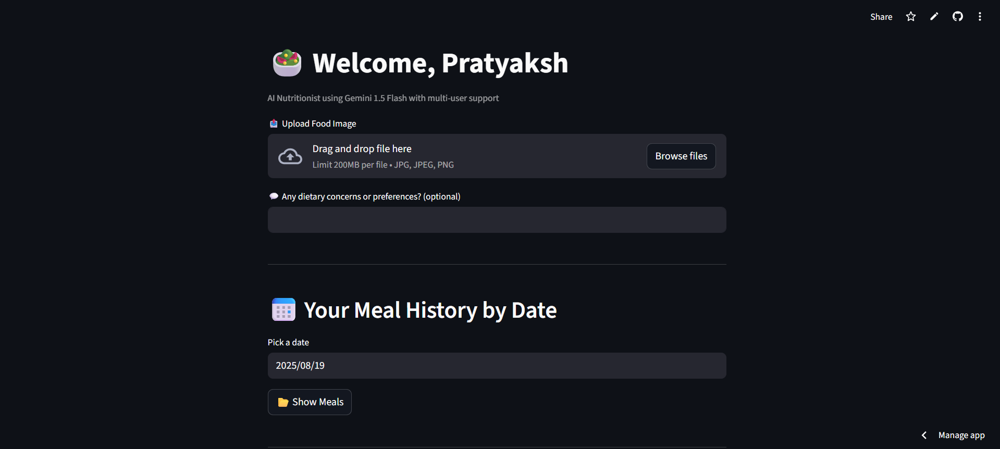
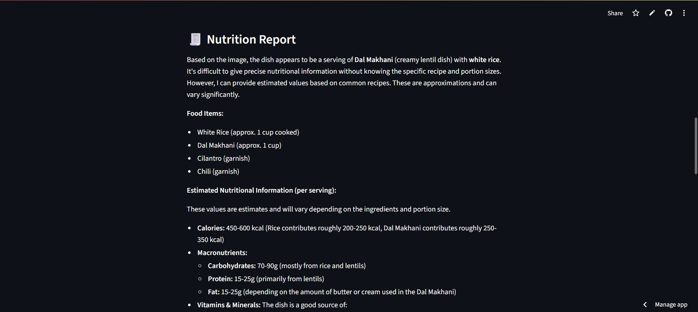

# 🧠 NutriTrack - AI Nutritionist Multi-User Diet Assistant

Welcome to **NutriTrack**, your intelligent AI-powered nutritionist built using **Gemini 1.5 Flash**. This app offers personalized meal insights and diet plans based on uploaded food images and user-specific dietary goals.

---

## 🚀 Features

- 📸 **Food Image Analysis**  
  Upload images of your meals (JPG, JPEG, PNG, up to 200MB) and get an instant AI-powered nutritional breakdown.

- 🧍‍♂️ **Multi-User Support**  
  Each user can track their dietary history, preferences, and plans securely.

- 📆 **Meal History by Date**  
  Select any date to view previously uploaded meals and analyses.

- 🥗 **Personalized Diet Plan Generator**  
  Generate tailored diet plans based on:
  - Age  
  - Gender  
  - Weight  
  - Health Goal (e.g., Weight Loss, Muscle Gain, Maintenance)

- 💬 **Dietary Preferences**  
  Optionally input dietary concerns like allergies, religious restrictions, or nutritional preferences (e.g., vegan, keto).

---

## 📱 App Overview

Below are some screenshots of the **NutriTrack** application in action:

<p align="center">
  
</p>

<p align="center">
  
</p>

<p align="center">
  
</p>

---

## 📷 How to Use

1. **Upload a Meal Image**  
   - Format: JPG, JPEG, or PNG  
   - Max size: 200MB  
   - You can drag and drop or click to upload.

2. **Enter Dietary Preferences (Optional)**  
   - Examples: “Gluten-free,” “Low sugar,” “Vegetarian,” etc.

3. **Select a Date**  
   - View your historical meals and nutrition summaries.

4. **Generate a Diet Plan**  
   - Provide your age, gender, weight, and goal.  
   - The app uses Gemini 1.5 Flash to return a personalized, healthy plan.

---

## 🧪 Tech Stack

- **Gemini 1.5 Flash API** – for image and text-based AI inference  
- **Streamlit** – for interactive frontend and backend integration  
- **Python** – for core logic and data processing  
- **SQLite** – lightweight database used to store user profiles, meal history, and dietary preferences  
- **SQLAlchemy** – ORM for interacting with the SQLite database  
- **Render/Streamlit** – for deployment

---

## 🗒️ Database Info

- The app uses **SQLite** via **SQLAlchemy** for all database operations.
- The database file `meals.db` is **auto-created** on the first run — no setup required.
- To keep your repository clean and protect user data, `meals.db` is excluded from version control using `.gitignore`.

---

## ⚙️ Setup (for Developers)

```bash
git clone https://github.com/PRATYAKSH15/NutriTrack.git
pip install -r requirements.txt
streamlit run app.py
